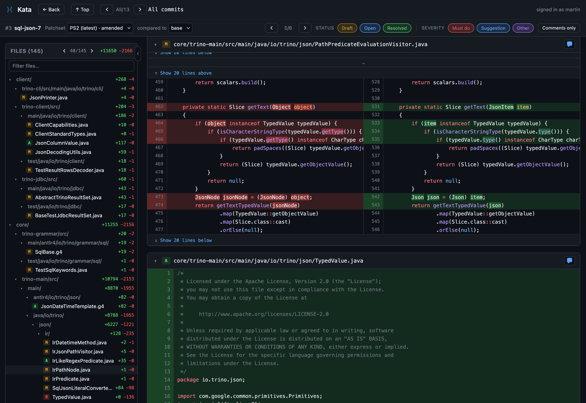

# Kata

**Code review for [Jujutsu](https://jj-vcs.github.io/jj/) — built around
how `jj` actually works.**

<p align="center">
  
</p>

Most review tools assume a commit is forever. `jj` deliberately makes
commits malleable — `squash`, `split`, and `rebase` are everyday
operations, and the same logical change goes through many revisions
before it lands. Kata embraces that:

- **Comments anchor to patchsets, not commits.** Rewrite history all you
  want; the thread on line 42 stays attached. Drift between rounds is
  surfaced rather than silently lost.
- **Reviews cover revsets, not branches.** A review scopes to whatever
  `jj` revset you choose — `trunk()..feature`, `mine()`, a stack of
  changes — not a fixed branch or a single PR.
- **Drafts, then publish.** Reviewers accumulate comments inside a
  private session and flush the batch atomically, so collaborators see a
  coherent review rather than a drip-feed of partial thoughts.
- **Human and agent reviewers, same surface.** Kata speaks both HTTP
  (the browser UI) and MCP (Claude and other agents) against the same
  service, so AI tools can leave grounded, citable comments on the diff
  the way a human can.
- **Reads like a diff tool, not a form.** Side-by-side or unified hunks,
  word-level highlights on paired edits, sticky threads while you scroll
  horizontally, a file tree that follows your scroll position.

## Quick start

```sh
# Build. Requires Rust 1.95+, `jj` on PATH, and `bun` for the embedded
# web bundle.
cargo build --release

# Run against one or more workspaces. Each gets its own URL slug.
./target/release/kata serve \
  --workspace main=/path/to/repo \
  --data /var/lib/kata \
  --author "Jane Doe <jane@example.com>" \
  --bind 127.0.0.1:7878
```

Open `http://127.0.0.1:7878`, pick a bookmark, type a revset, and the
new review is ready to comment on.

Every flag mirrors an environment variable (`KATA_WORKSPACE`,
`KATA_DATA`, `KATA_AUTHOR`, `KATA_BIND`, `KATA_WEB_DIR`, …) so it drops
cleanly into systemd, Docker, or whatever config management you're
already using. Add more workspaces by repeating `--workspace`; bare
paths derive the slug from the directory name, or pass `name=path` to
override.

## How it works

A **review** pins a revset, a base commit, and a tip commit — that's
the first **patchset**. When the author rewrites the underlying branch
(an `amend`, a `rebase`, a `squash` into an earlier change), the
reviewer hits *Refresh* and Kata records the new endpoints as the next
patchset. Comments belong to the patchset they were written on, so they
don't move; the UI shows when an anchor has drifted past its original
content and lets the reader jump back to the patchset where the comment
was authored.

Reviewers work inside a **session** that holds drafts until they're
ready. *Publish* flushes the whole batch; *Discard* throws it away.
Sessions are per-author, so multiple reviewers can be writing
simultaneously without seeing each other's drafts.

## Reviewing with agents (MCP)

Kata exposes the same review service over the Model Context Protocol,
so agents can read diffs and leave grounded comments on them. A single
endpoint at `/mcp` fronts every configured workspace and advertises
both tools and resources.

The server publishes a `kata-review` **skill** as an MCP resource at
`skill://kata/review` — pre-built guidance for an agent doing a code
review. Reference it from Claude Code today as
`@<server>:skill://kata/review`; native skill auto-registration is
tracked in
[anthropics/claude-code#38253](https://github.com/anthropics/claude-code/issues/38253).

Tools available: `list_repos`, `list_bookmarks`, `list_reviews`,
`get_review`, `create_review`, `refresh_review`,
`update_review_summary`, `start_session`, `publish_session`,
`discard_session`, `draft_line_comment`, `draft_file_comment`,
`draft_review_comment`, `update_draft_comment`, `respond`. Workspace-
scoped tools take a `repo` argument; call `list_repos` first to see the
available slugs.

## Architecture

| Crate          | Purpose                                                       |
| -------------- | ------------------------------------------------------------- |
| `kata-core`    | Domain types (`ReviewId`, `ChangeId`, `Flag`, …).             |
| `kata-jj`      | `jj` CLI driver: bookmarks, revsets, diffs.                   |
| `kata-storage` | On-disk manifest + comment store.                             |
| `kata-service` | Repo-agnostic review service shared by both transports.       |
| `kata-server`  | `axum` HTTP server; serves the API and the embedded web app.  |
| `kata-mcp`     | MCP transport (Streamable HTTP) over the same service.        |

The Svelte 5 frontend lives in `web/`. The release binary embeds
`web/dist` via `rust-embed`; pass `--web-dir <path>` at runtime to
serve a different bundle, which is what you want during UI development
(`cd web && bun run dev` for the Vite dev server).

## Development

```sh
# Skip the web build — useful when iterating on the backend crates.
KATA_SKIP_WEB_BUILD=1 cargo build

# Run the workspace test suite (Rust + frontend).
cargo test
cd web && bun --bun vitest run
```

Open issues and PRs are welcome.

## License

[Apache-2.0](LICENSE). See [THIRD_PARTY_LICENSES.md](THIRD_PARTY_LICENSES.md)
for the licenses of the dependencies Kata bundles; regenerate it with
`scripts/gen-licenses.sh` after any dependency change.
