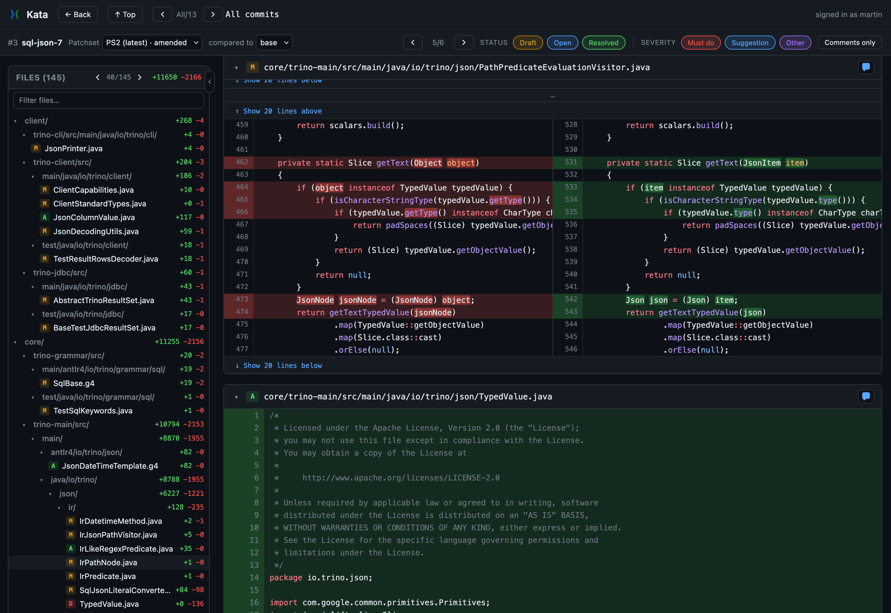

# Kata

Code review for [Jujutsu](https://jj-vcs.github.io/jj/), built around
how `jj` actually works — and equally usable by human reviewers and
AI agents.

<p align="center">
  
</p>

Most review tools assume a commit is forever. `jj` deliberately makes
commits malleable — `squash`, `split`, and `rebase` are everyday
operations, and the same logical change goes through many revisions
before it lands. Kata is built around that:

- **Comments anchor to patchsets, not commits.** Rewrite history all
  you want; the thread on line 42 stays attached, and drift between
  rounds is surfaced rather than silently lost.
- **Reviews scope to revsets, not branches.** Any `jj` revset —
  `trunk()..feature`, `mine()`, a stack of three changes by
  `change_id`.
- **Same surface for humans and agents.** The browser UI and the MCP
  endpoint hit the same service, so a Claude Code session can leave
  grounded, line-anchored comments the way a person would.

## Try it

Requires Rust 1.95+ and [`bun`](https://bun.com/) for the embedded
web bundle.

```sh
cargo build --release
./target/release/kata demo --data /tmp/kata-demo
```

Open the URL it prints; append `?demo=1` for a guided tour through
the core features. The demo seeds a self-contained `jj` workspace +
database with a small review and points the server at it.

Or, with Docker (no local toolchain needed):

```sh
docker compose --profile demo up --build
```

Builds the image on demand and serves the same guided tour at
`http://localhost:7878`. Drop the `--build` to pull the published
image from `ghcr.io/martint/kata:latest` instead. The default
service (without `--profile demo`) serves real workspaces — see
[`docs/deploying.md`](docs/deploying.md).

## Run it for your repo

```sh
./target/release/kata serve \
  --workspace main=/path/to/repo \
  --data /var/lib/kata \
  --author "Jane Doe <jane@example.com>" \
  --bind 127.0.0.1:7878
```

Open `http://127.0.0.1:7878`, pick a bookmark, type a revset, and the
review is ready to comment on. Repeat `--workspace` for multiple
repos; every flag mirrors a `KATA_*` environment variable.

The default bind is loopback-only and the default auth trusts
client-supplied identity — fine for a single-user laptop, **wrong
for anything shared**. For team deployments — TLS, OIDC, header-
based auth, agent API tokens — see [`docs/deploying.md`](docs/deploying.md).

## How a review works

A **review** pins a revset, a base commit, and a tip commit — the
first **patchset**. When the author rewrites the branch underneath
(amend, rebase, squash), the reviewer hits *Refresh* and Kata records
the new endpoints as the next patchset.

Comments belong to the patchset they were written on. When an anchor
drifts past its original content, the UI surfaces that explicitly and
lets the reader jump back to the patchset where the comment was
authored — drift is never silent and comments never silently relocate
to the wrong line.

Reviewers accumulate drafts inside a per-author **session**.
*Publish* flushes the batch atomically; *Discard* throws it away.
Sessions are private, so multiple reviewers work in parallel without
seeing each other's drafts.

The full product specification is in [`docs/SPEC.md`](docs/SPEC.md).

## Reviewing with agents (MCP)

Kata serves the same review service over the Model Context Protocol
at `/mcp`. A `kata-review` **skill** at `skill://kata/review` ships
pre-built guidance for an agent doing a code review — reference it
in Claude Code as `@<server>:skill://kata/review`.

The MCP surface mirrors every write path on the HTTP API:

- **Read** — `list_repos`, `list_bookmarks`, `list_reviews`,
  `get_review`.
- **Review lifecycle** — `create_review`, `refresh_review`,
  `update_review_summary`, `update_review_revset`,
  `archive_review` / `unarchive_review`, `delete_review`.
- **Sessions** — `start_session`, `publish_session`,
  `discard_session`.
- **Comments** — `draft_line_comment`, `draft_file_comment`,
  `draft_review_comment`, `update_draft_comment`,
  `delete_draft_comment`.
- **Responses** — `respond`, `update_response`,
  `delete_draft_response`.
- **Annotations** (author-only) — `add_line_annotation`,
  `add_file_annotation`, `update_annotation`, `delete_annotation`.

Workspace-scoped tools take a `repo` argument; call `list_repos`
first.

## Architecture

| Crate          | Purpose                                                       |
| -------------- | ------------------------------------------------------------- |
| `kata-core`    | Domain types (`ReviewId`, `ChangeId`, `Flag`, …).             |
| `kata-jj`      | In-process `jj-lib` backend: bookmarks, revsets, diffs.       |
| `kata-storage` | On-disk manifest + comment store.                             |
| `kata-service` | Repo-agnostic review service shared by both transports.       |
| `kata-server`  | `axum` HTTP server; serves the API and the embedded web app.  |
| `kata-mcp`     | MCP transport (Streamable HTTP) over the same service.        |
| `kata-demo`    | Reusable seeder for the `kata demo` subcommand's guided tour. |

The Svelte 5 frontend lives in `web/`; the release binary embeds
`web/dist` via `rust-embed`.

## Develop

```sh
KATA_SKIP_WEB_BUILD=1 cargo build   # iterate on backend; skip the web rebuild
cargo test                          # workspace tests
cd web && bun --bun vitest run      # frontend tests
cd web && bun run dev               # Vite dev server on :5173, proxies /api → :7878
```

Pass `--web-dir <path>` to `kata serve` to serve a pre-built bundle
from disk instead of the embedded one, useful while iterating on the
bundle without rebuilding the binary.

Issues and PRs welcome.

## License

[Apache-2.0](LICENSE). Bundled dependency licenses are listed in
[`THIRD_PARTY_LICENSES.md`](THIRD_PARTY_LICENSES.md); regenerate it
with `scripts/gen-licenses.sh` after any dependency change.
